# Chapter 1 引言

> **1.1** 考虑下图的组合电路，它有多少个单固定型故障（single stuck-at fault）？多少个多固定型故障（multiple stuck-at fault）？经过故障删减（fault collapsing）技术，这个电路还剩多少个故障？
>
> 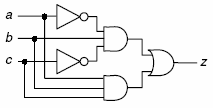

图中一共有14个线节点，因此：

* SF：$2\times14=18$

* MF：$3^{14}-1=4782968$

* Fault Collapsing：

  $2\times(P_o+F_o)+G_l-N_l=2\times(1+3)+10-2=10$

> **1.3** 为了检测一个 n 输入与非门的所有单固定型故障，最少需要多少个向量？给出这个最小测试集，以及每个测试能够检测哪个（些）故障。

最少需要$n+1$个向量：

* 位宽为$n$的全1向量1111……1：用来检测输出SA1和任意输入的SA0
* 第$i$位为0，其余位为1：用来检测第$i$个输入SA1和输出SA0

# Chapter 2 可测试性设计

> **2.1** 为一个 3 输入异或门和它的 NAND-NOR 实现，计算每根线的 SCOAP 可控制性和可观测性指标：在每根线上以“0-可控制性/1-可控制性/可观测性”形式标注。

* 3输入异或门

  设其输入为A，B，C，输出为Z。首先注意到真值表：

  $Z=A\overline B\overline C+\overline A B\overline C+\overline A\overline B C+ABC$

  这也就代表，$CC_1(z)$应该等于这四种组合可控制性的最小值加一，而这四种组合的可控制性均为3，故$CC_1(z)=4$。同理，$\overline Z$与或式由互补的四项组成，故$CC_0(z)=4$。

  再考虑A的可观测性。注意到$Z=A\oplus(B\oplus C)$，根据异或门特点，只需要$B\oplus C$为1或为0，即可将A的值反映在Z上。根据2输入异或门的计算方式，可以求得$B\oplus C$的可控制性因子为2（注意这不是真正的门，因此无需+1）。因此$CO(A)=CO(Z)+2+1=3$。其余两个输入的可观测性同理为3。

  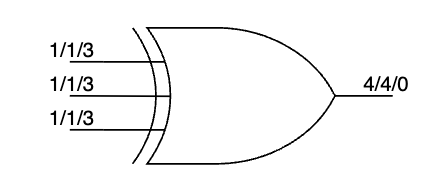

* NAND-NOR实现

  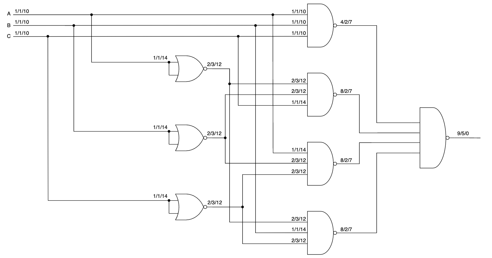
  
  注意SCOAP并没有关注相关性，也就是一根线送到同一个门两个输入的情况

> **2.2** 为一个 3 输入异或门和它的 NAND-NOR 实现，计算每根线的基于概率的可控制性和可观测性指标：在每根线上以“0-可控制性/1-可控制性/可观测性”形式标注。假定原始输入的基于概率的可控制性指标为 0.5/0.5，原始输出的基于概率的可观测性指标为 1。

* 3输入异或门

  与上一题类似，可控制性只是将最小运算改为乘加，可得$CC_1(Z)=4\times0.5^3=0.5$，同理$CC_0(Z)=0.5$。

  对于可观测性，只需要$B\oplus C$为1或为0，即可将A的值反映在Z上，因此$CO(A)=CO(Z)\cdot CO(B\oplus C)=0.5$。

  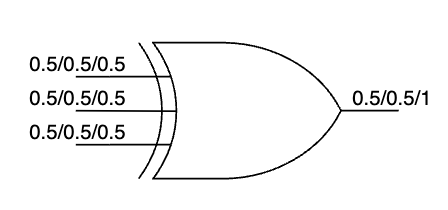

* NAND-NOR实现

  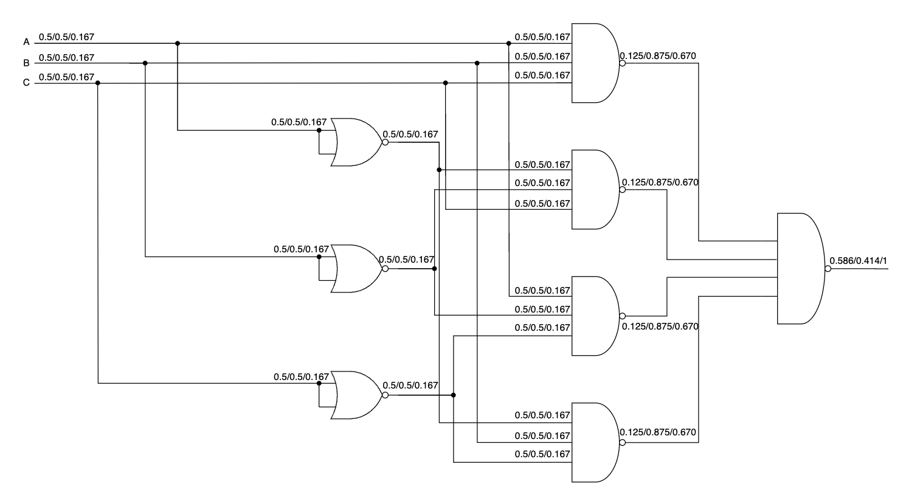

  注意，在第一个同输入的或非门上，由于两个输入是同一个信号，因此输出为1不应该是积事件。这本质上是一个非门，直接按照非门来做。

> **2.9** 对一个全扫描设计施加 N 个测试向量，假定该设计有 M 条扫描链，每条扫描链由 L 个扫描单元构成，扫描测试过程如图所示，列式计算完成测试所需要的时钟周期。
>
> 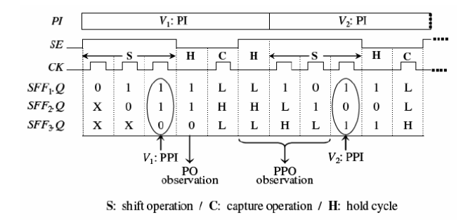

（必须说出用Hold Cycle）观察其流水化思想，可以看出，每个测试用例需要(L+3)个周期进行流水，整个流程最后还需要(L-1)个周期获取最后一个测试用例的输出。故所需的总周期数为：
$$
N\cdot (L+3)+(L-1)
$$

> **2.10** 在扫描测试过程中，描述测试模式信号 TM 和扫描使能信号 SE 各自的功能。

测试模式信号TM为1时，所有测试装置被启用，送入电路的数值为扫描链中的测试数据；TM为0时，电路的输出DI会被定向到DO上，这时电路处于正常工作状态。

SE为1时，电路处于扫描移位模式，从而可以为每个扫描触发器通过扫描链供应所需要的测试数据；SE为0时，电路处于捕获模式，扫描单元用于捕获组合电路的响应。

> **2.19** 下图中违背了哪条扫描设计规则？请增加可测性设计修复电路，画出修复后的电路图。
>
> 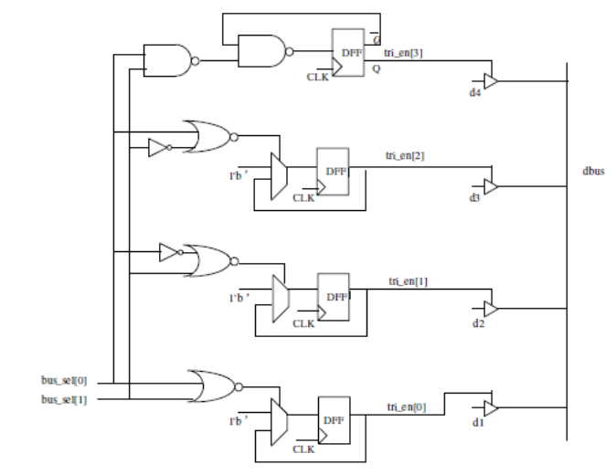

扫描移位时会发生总线竞争。可以使用 SE 信号来控制避免总线竞争。如下图：

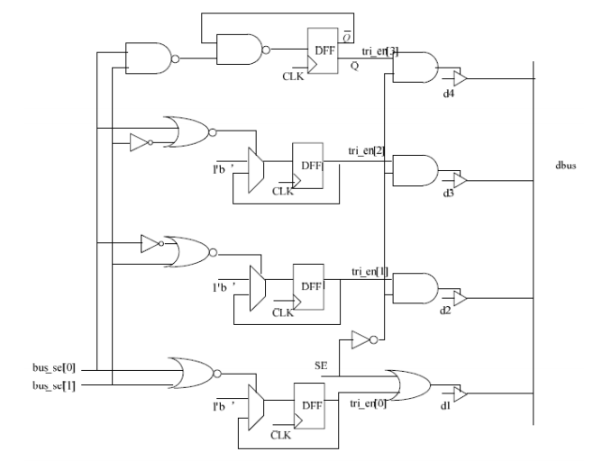

这里通过SE，保证了在移位期间，总线上只有d1一个驱动有效，避免了总线竞争。

> **3.2** 为下图中的电路，分别根据以下时延模型，完成其定时图（timing diagram）。
>
> 1. Nominal delay: 2 输入门-1ns；3 输入门-1.2ns；反向器-0.6ns
>
>    Inertial delay: 所有门- 0.3ns
>
> 2. Rise delay: 2 输入门-0.8ns；3 输入门-1ns；反向器-0.6ns
>
>    Fall delay: 2 输入门-1ns；3 输入门-1.2ns；反向器-0.8ns
>
> 3. Minimum delay: 2 输入门-0.8ns；3 输入门-1ns；反向器-0.6ns
>
>    Maximum delay: 2 输入门-1ns；3 输入门-1.2ns；反向器-0.8ns

1. Nominal+Inertial delay：

   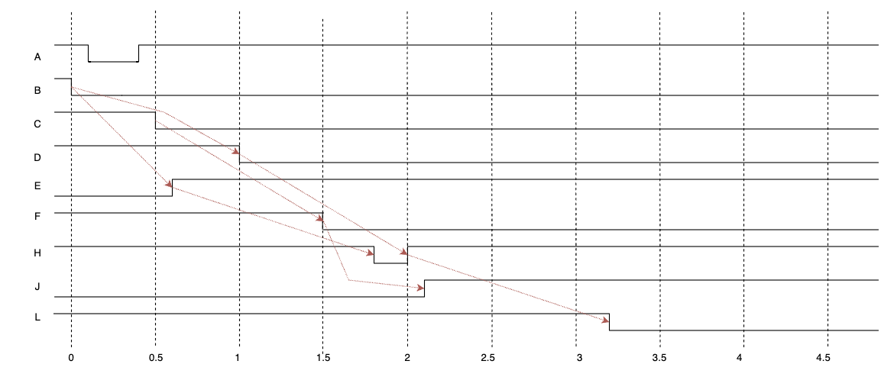

2. Rise/Fall delay：

   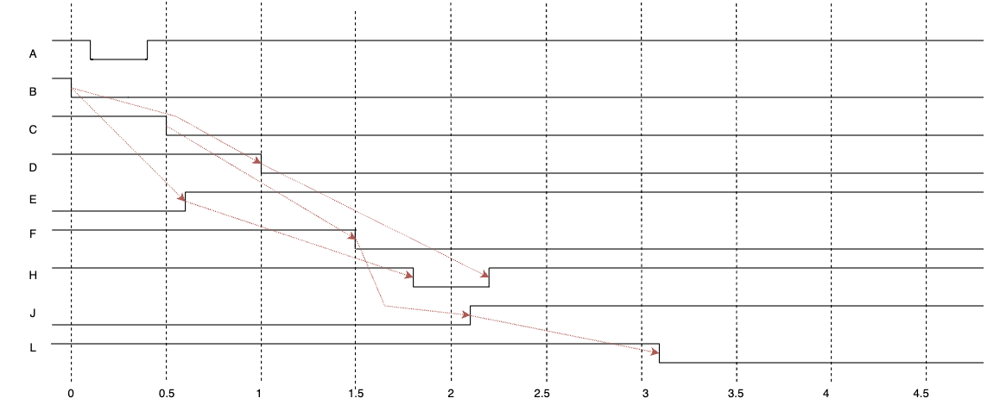

3. Min-Max delay：

   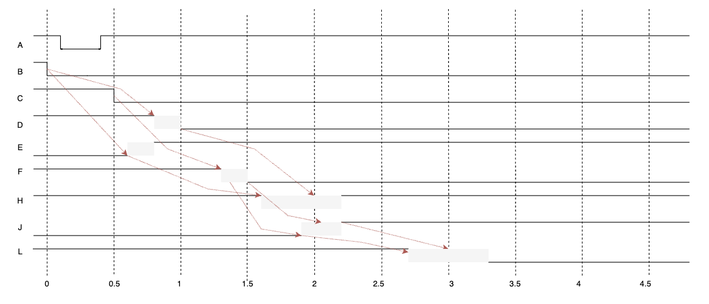

> **3.3** 首先对下图中的电路进行逻辑分级（logic levelization），原始输入是第 1 级，请把每个门所处的逻辑级标注在门中。假定采用编译后模拟（compiled-code simulation）技术，写出模拟该电路所产生的操作伪码，假定编译只支持基本逻辑操作：2 输入 AND/OR，NOT。
>
> 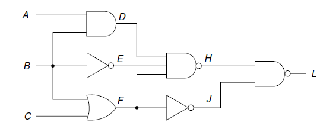

首先分级结果如下：

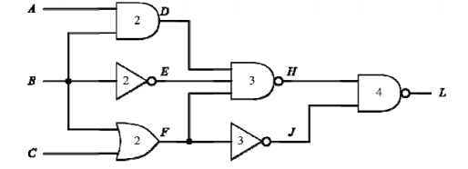

操作伪代码：

```verilog
while(true) do
  	read(A, B, C)
  	D = AND(A, B)
    E = NOT(B)
  	F = OR(B, C)
    H = AND(D, E)
  	H = AND(H, F)
  	H = NOT(H)
    J = NOT(F)
    L = AND(H, J)
    L = NOT(L)
end
```

> **3.7** 对下图中的电路和给定的 2 个单固定型故障，使用 parallel-pattern single-fault propagation故障模拟技术，画出模拟过程中正常电路/故障电路的状态，并识别故障被哪个测试向量所检测。
>
> 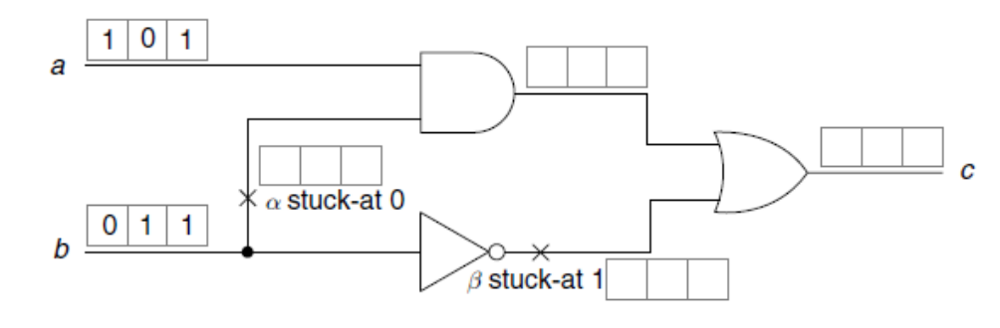

首先，分别对无故障、注入$\alpha$、注入$\beta$进行计算：

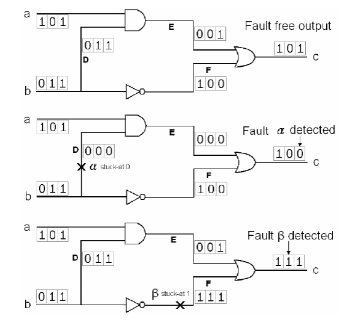

列出表格：

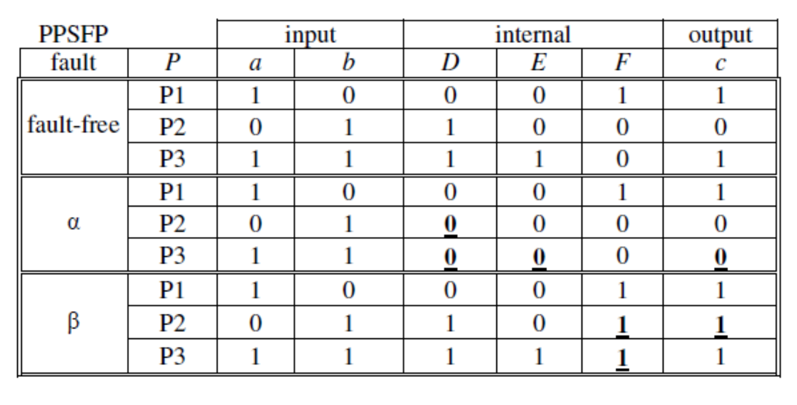

因此$\alpha$被P3（11）检测出，而$\beta$被P2（01）检测出

> **3.8** 使用Parallel Fault Simulation重做3.7

三个测试用例分别是10,01,11，由于有两个错误，所以我们将这三个测试用例复制三份，并进行错误注入：

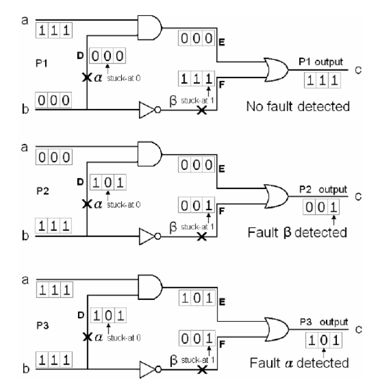

找到与无故障不同的比特，根据错误列出表格：

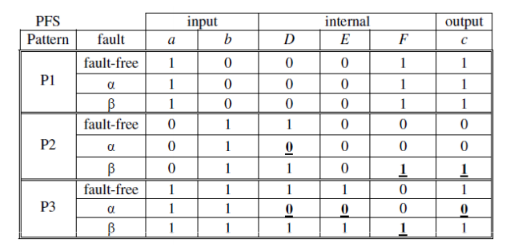

因此$\alpha$被P3（11）检测出，而$\beta$被P2（01）检测出。

# Chapter 4 测试生成

> **3.1** 某电路由7根外部输入线(a，b，c，d，e，f，g)和3根外部输出线(x，y，z)组成。从电路结构上看, x只可能受到a、b、c的影响, y只可能受到c、d、e、f的影响, z只可能受到e、f、g的影响。为这个电路设计一个尽量小的伪穷举测试集合。

x的逻辑锥有3个输入，y的逻辑锥有4个输入，z的逻辑锥有3个输入。那么对于伪穷举，我们需要$2^4=16$组测试

算法：从中间信号入手，先穷举中间信号，这里是y

设每个向量代表(a,b,c,d,e,f,g)，则初始的16个输入向量如下：

(0,0,0,0,0,0,0), (0,0,0,0,0,1,0), (0,0,0,0,1,0,0), (0,0,0,0,1,1,0),

(0,0,0,1,0,0,0), (0,0,0,1,0,1,0), (0,0,0,1,1,0,0), (0,0,0,1,1,1,0),

(0,0,1,0,0,0,0), (0,0,1,0,0,1,0), (0,0,1,0,1,0,0), (0,0,1,0,1,1,0),

(0,0,1,1,0,0,0), (0,0,1,1,0,1,0), (0,0,1,1,1,0,0), (0,0,1,1,1,1,0)

然后再看x，x只测试了两组，因此只需要在这16组里找6组添加测试即可。这里选择了第一行和第三行：

(0,0,0,0,0,0,0), (0,1,0,0,0,1,0), (1,0,0,0,1,0,0), (1,1,0,0,1,1,0),

(0,0,0,1,0,0,0), (0,0,0,1,0,1,0), (0,0,0,1,1,0,0), (0,0,0,1,1,1,0),

(0,0,1,0,0,0,0), (0,1,1,0,0,1,0), (1,0,1,0,1,0,0), (1,1,1,0,1,1,0),

(0,0,1,1,0,0,0), (0,0,1,1,0,1,0), (0,0,1,1,1,0,0), (0,0,1,1,1,1,0)

最后看z，z只测试了4组，再补充4组即可。这里选择了第二行：

(0,0,0,0,0,0,0), (0,1,0,0,0,1,0), (1,0,0,0,1,0,0), (1,1,0,0,1,1,0),

(0,0,0,1,0,0,1), (0,0,0,1,0,1,1), (0,0,0,1,1,0,1), (0,0,0,1,1,1,1),

(0,0,1,0,0,0,0), (0,1,1,0,0,1,0), (1,0,1,0,1,0,0), (1,1,1,0,1,1,0),

(0,0,1,1,0,0,0), (0,0,1,1,0,1,0), (0,0,1,1,1,0,0), (0,0,1,1,1,1,0)

> **3.2** 举例说明回溯(backtrack)和回退(backtrace)的区别。

* 回溯（backtrack）是 PODEM 算法中的一个操作，用来在目前选择的外部输入线和相应逻辑赋值之下不可能成功地生成测试向量的情况下，对外部输入线实施尚未尝试的逻辑赋值或对尚未赋过值的外部输入线实施逻辑赋值，以探索测试向量生成的可能性。 

* 回退（backtrace）是 PODEM 算法中的一个操作，用来从某根信号线逆向（向电路外部输入方向）退回到一根外部输入线，并确定针对该外部输入线的逻辑赋值，以有助于实现故障激活或故障传播。

> **3.4** 右图所示电路的单固定型故障的总数是多少？测试向量(< 𝒂 = 𝟎, 𝒃 = 𝟏, 𝒄 = 𝟏, 𝒅 = 𝟎, 𝒆 = 𝟏 >)一共可检出几个故障？
>
> 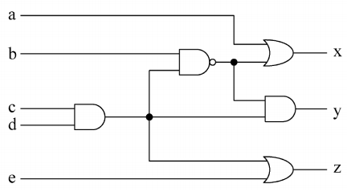

图中一共有15个节点，k=2，一共有30个单固定性故障。按照图中进行编号：

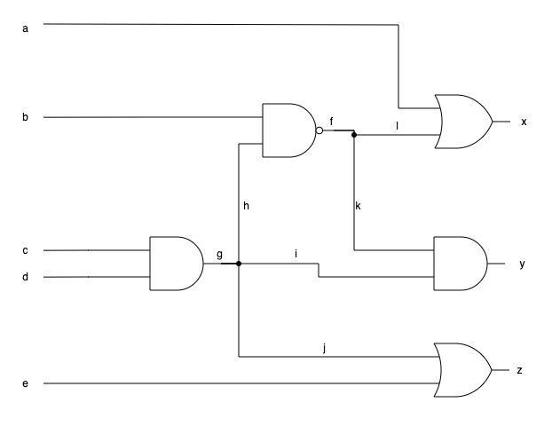

可以检测出的故障有：d SA1, e SA0, f SA1, g SA1, h SA1, i SA1, l SA0, x SA0, y SA1, z SA0

从结果向前追踪，找每个门的控制值，非控制值是传递不出去的（例如a SA1）

> **3.5** 利用PODEM分别为下图所示电路中的2个故障生成测试立方或测试向量。
>
> 1. 信号线L5的固定0故障（s-a-0）
> 2. 信号线L4的固定1故障（s-a-1）
>
> 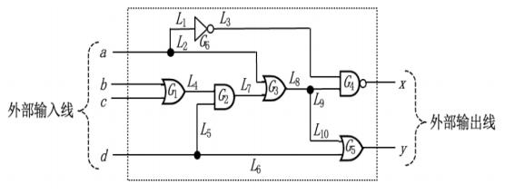

1. L5 SA0故障检测

   * 对于L5的故障，设置d=1，此时D前沿在G2
   * 将b设置为1，使得L4为1，L7为D，推进D前沿到G3
   * 将a设置为0，使得L2为0，推进D前沿到G4。同时，L3也为1，x变为D-bar，反映成功

   因此测试立方：a=0，b=1，c=X，d=1

2. L4 SA1故障检测

   * 对于L4的故障，设置b=0，c=0，此时D前沿在G2
   * 将d设置为1，使得L5为1，D前沿推进到G3
   * 与上一题类似，将a设置为0，可以推进D前沿到G4，并使得x变为D-bar，反映成功

   因此测试立方：a=0，b=0，c=0，d=1

> **4.13** 如右图所示电路，分别给出g=0以及f=0的静态逻辑蕴涵。
>
> 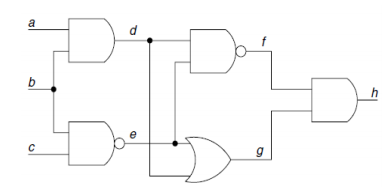

1. g=0时，h=0, d=0, e=0, f=1, b=1, c=1, a=0
2. f=0时，h=0, d=1, e=1, g=1, a=1, b=1, c=0

> **4.17** 如下图所示电路，
>
> 1. 计算 b=0 的静态逻辑蕴涵；
> 2. 计算 b=1 的静态逻辑蕴涵；
> 3. 计算 b=0 时不可检测的故障集；
> 4. 计算 b=1 时不可检测的故障集；
> 5. 根据 b 线进行冲突分析得到不可检测的故障集。
>
> 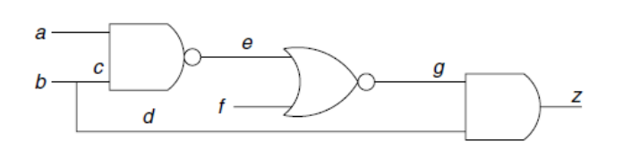

1. b=0时，c=0, d=0, e=1, g=0, z=0

2. b=1时，c=1, d=1

3. b=0时不可激活的故障集合：{b/0, c/0, d/0, e/1, g/0, z/0}

   b=0时不可观测的故障集合：{a/0, a/1, f/0, f/1, d/0, d/1, g/0, g/1, e/0, e/1, c/1}

   不可检测的故障集合：{a/0, a/1, b/0, c/0, c/1, d/0, d/1, e/0, e/1, f/0, f/1, g/0, g/1, z/0}

4. b=1时不可激活的故障集合：{b/1, c/1, d/1}

   b=1时不可观测的故障集合：{}

   不可检测的故障集合：{b/1, c/1, d/1}

5. b线冲突分析结果为二者交集：{c/1, d/1}

> **4.31** 如右图所示电路，这个电路中有多少条通路？
>
> 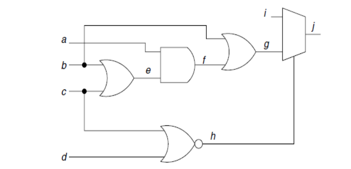

逻辑通路（通路时延故障）：共14条，是物理通路数的2倍

物理通路：从输入到输出，共7条

# Chapter 5 逻辑自测试

> **5.1** 针对由3个三态门构成的三态总线设计一个独热（one-hot）解码器，以便在LogicBIST模式下（BIST_Mode=1）避免发生总线竞争，从而防止大电流对电路造成损坏。

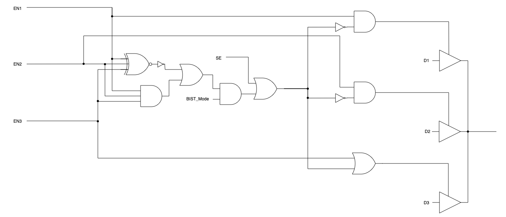

注意三输入同或门和三输入异或门真值表相同

> **5.2** 针对双向I/O端口，设计一个X屏蔽电路，使之在LogicBIST模式下（BIST_Mode=1）被强制设置为输入。 针对双向I/O端口，设计一个X屏蔽电路，使之在LogicBIST模式下（BIST_Mode=1）被强制设置为输入。

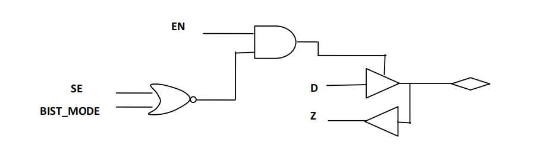

> **5.3** 下图中的逻辑值为该LSFR的初始状态，请给出该LSFR的输出序列。 下图中的逻辑值为该LSFR的初始状态，请给出该LSFR的输出序列。
>
> 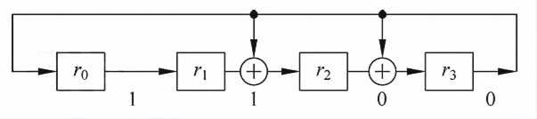

1100,0110,0011,1010,0101,1001,1111,1100,......

> **5.4** 下图是一个特征多项式为$𝑓(𝑥) = 1 + 𝑥 + 𝑥^4$的4段单输入特征寄存器（Single-Input Signature Register，SISR）。假定正确电路的输出序列 M = {10011011},假设某个故障存在于被测电路当中，其输出序列为M' = {11111111} 。试问该故障是否可被检测？
>
> 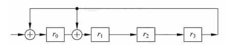

错误多项式$E(x)=10011011+11111111=01100100=x+x^2+x^5$，$E(x)=xf(x)$，可以被整除，因此不能被检测

> **5.5** 修改下面的 LFSR，使其输出 x1,x2,x3,x4 取 1 的权重分别为 0.75, 0.5, 0.25, 0.125。
>
> 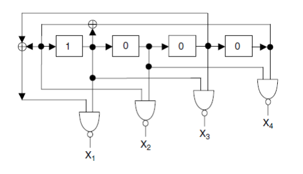

图中的LFSR最终会陷入0101和1010的循环，因此每一位输出均为50%概率为1。由于第三位和第一位一定相同，因此这个异或始终为0，再加上第四位的异或，X1位置左侧输入为1的概率应该恰好为0.5。因此如果要让X1输出1的概率为0.75，只需要把与非门改为或门。X2将第二位输出直接接出即可：

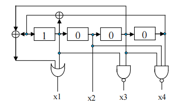

> **5.11** 假定正确电路输出响应为R0={01101111}，故障电路的输出响应为R1={00110001}，分别采用ones-count和transition-count响应压缩机制计算其特征；哪种响应压缩机制可以检测到故障？这2种响应压缩机制的混淆率（aliasing probability）分别是多少？

1. 1计数检测：

   正确输出有6个1，错误输出有3个1，能检测出

   错误屏蔽概率：$P_{OC}(6)=\frac{C_8^6-1}{2^8-1}=0.11$

2. 跳变计数检测：

   正确输出有3次跳变，错误输出有3次跳变，不能检测出

   错误屏蔽概率：$P_{OC}(6)=\frac{C_7^6-1}{2^8-1}=0.27$

# Chapter 6 测试压缩

> **6.1** 简要阐述测试压缩、逻辑自测试、和传统的扫描测试的异同点。

测试压缩、逻辑内建自测试、和传统的扫描测试都是基于扫描链技术的数字芯片结构测试方法。

* 扫描测试是基于扫描链的最初结构测试方法，测试激励通过测试仪经由扫描链移入芯片内部的触发器或锁存器，通过一个或多个捕获周期后，测试响应再经由扫描链移出芯片，由测试仪同预期响应进行对比。不难看出，传统扫描测试中每个测试向量的激励和预期响应都是存储在测试仪上的。
* 在逻辑内建自测试中，所有测试激励都是由芯片上的伪随机向量生成模块自动生成的，所有测试响应也是通过响应压缩模块，最终生成一个压缩特征值（Signature），因此，测试仪只需要比较最终的压缩特征值，即可判定一个逻辑内建自测试是否通过。
* 测试压缩指的是针对每一个测试向量，降低其在测试仪内存中的所需数据量，包含输入端的测试激励压缩和输出端的测试响应压缩，因此测试压缩在芯片上必须内置激励解压缩模块和响应压缩模块。其结果是，对于同样大小的内存，可以存储更多的测试向量，并且从测试仪的角度来看，测试压缩的向量使用机制同传统扫描测试完全兼容。

> **6.2** 下图是一个简单的基于解码器的测试激励解压缩模块。
>
> 1. 请用基本的逻辑门设计一个组合解码电路，使用输入端向量组合产生对应的扫描链测试激励
> 2. 这种基于解码电路的测试激励解压缩模块的功能设计是唯一的吗？为什么？
>
> 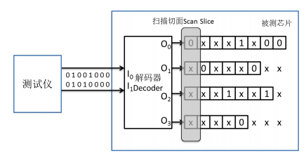

1. 根据第1、3、6、7、8个测试，可以归纳出00译码为0010

   根据第2个测试，可以归纳出11译码为0000

   根据第4个测试，可以归纳出01译码为0010

   根据第5个测试，可以归纳出10译码为1000

   设输入为$A_1A_0$，那么$O_0=A_1\overline {A_0}, O_1=0,O_2=\overline{A_0},O_3=0$

2. 不是，例如00可以归纳译码为0001

> **6.3** 测试激励压缩的一种常见设计方法是广播模式法，即每条扫描链载入相同的数据值。通过分析ATPG产生的测试向量，可以发现，在大多数情况下，不同扫描链上的数据值是不一样的，也就是说这些向量不满足广播模式法的约束条件。但为什么广播模式法在许多电路设计中是非常有效的呢？请解释原因。

虽然在大多数情况下，ATPG 生成的测试向量在不同扫描链上的数据值是不一样的，但这并不代表 ATPG 不能生成满足广播模式法的约束条件的测试向量，因为每个故障的测试向量不是唯一的。实际情况是，当进行 ATPG 时加上广播模式法的约束条件，绝大多数故障是可以生成测试向量的，这也是为什么广播模式法在许多电路设计者是非常有效的。

> **6.4** 在线性方程法的测试激励压缩设计中，基于LFSR的静态种子重置是一种常见的方法。下图给出了一个4位LFSR，假定我们需要在x0端产生0xx1xx1xxx（最左边的值最先产生）的输出序列，请采用线性方程法计算出LFSR需要的静态种子值。这个种子值是唯一的吗？为什么？
>
> 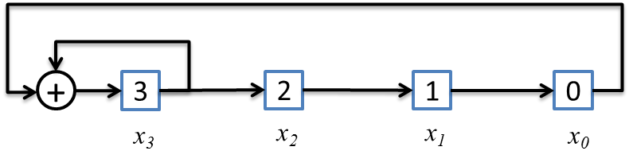

设输出为Z，我们看到只需要求解$Z_0, Z_3,Z_6$，因此我们开始递推：

$Z_0=x_0, Z_1=x_1, Z_2=x_2, Z_3=x_3, Z_4=Z_0\oplus x_3,Z_5=Z_1\oplus Z_4, Z_6=Z_5\oplus Z_2$

随后替换右式中的Z：

$Z_0=x_0, Z_3=x_3, Z_6=x_0\oplus x_1\oplus x_2\oplus x_3$

列出线性方程：
$$
\begin{bmatrix}
1,0, 0, 0 \\ 0,0,0,1\\1,1,1,1
\end{bmatrix} \times
\begin{bmatrix}
x_0\\x_1\\x_2\\x_3
\end{bmatrix} = 
\begin{bmatrix}
0\\1\\1
\end{bmatrix}
$$
求解可得：$x_0=0,x_3=1,x_1\oplus x_2=0$

因此一个可行解是$x_0=0,x_1=1, x_2=1, x_3=1$，同时也说明该解不唯一，还可以是$x_0=0,x_1=0, x_2=0, x_3=1$

> **6.5** 请阐述静态种子重置和动态种子重置的主要区别。它们的优缺点各是什么？

* 静态种子重置只需要存储测试向量的种子，可以有很高的压缩比。由于 LFSR 的编码特性，其大小必须同测试向量中确定的 0/1 比特数相当。当芯片设计规模变大的时候，这可以是一个非常大的数字。
* 动态种子重置在 LFSR 的自动运行模式中同时插入外部的自由变量，动态种子重置的一个重要优势是测试仪可以不停地输入数据，不会陷入空闲状态，并且它可以使用更小的LFSR 达到同静态种子重置同样的编码效率。

> **6.6** 请解释为什么基于线性方程法的压缩向量生成需要用两步ATPG

因为线性方程组对 ATPG 工具而言难以定义约束条件，所以合适的做法是让ATPG 先生成基于扫描链的测试向量，再通过线性方程组对测试向量进行压缩，即所谓两步 ATPG。

> **6.7** 测试响应压缩希望达到的目标有哪些？它的主要难点在哪里？

* 测试响应压缩希望达到的目标主要有 3 点：

  1. 压缩测试响应的数据量；
  2. 保证目标故障的检测和诊断；
  3. 同现有芯片测试仪平台工作流程兼容。
* 它的主要难点在：

  1. 如何处理响应中的 X 值；
  2. 如何避免故障抵消。

> **6.8** 下图展示了两条扫描链的测试响应通过一个异或门进行压缩，其中阴影的值代表一个特定故障模拟中的差错位，它和预期的仿真值正好相反。在这种情况下，出现了几种响应压缩中的常见问题？该故障是否能被检测到？请说明原因。
>
> 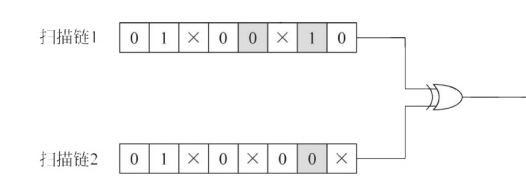

1. 故障抵消：右数第二个位的异或会导致扫描链2的输出被抵消，无法观测
2. X屏蔽：右数第四个位将0与X异或，其结果仍为X，无法观测

> **6.9** 分析下图中的有X耐受性的响应压缩模块，请说明：
>
> 1. 扫描链6中的差错位会出现在哪个输出端口上？
> 2. 扫描链7中的差错位会出现在哪个输出端口上？
> 3. 当扫描链6和扫描链7在一个扫描切面上同时出现了差错位时，最终哪个输出端口会检测到差错信息?
>
> 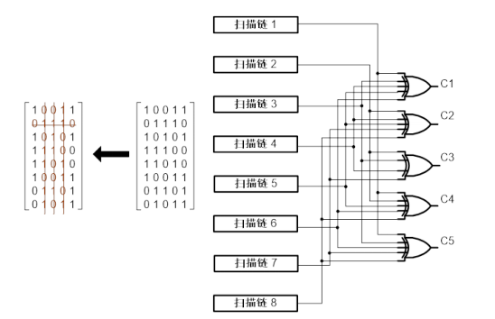

1. 6的差错位会出现在C1、C4、C5上

2. 7的差错位会出现在C2、C3、C5上

3. 6的差错位会出现在C1、C4上

   7的差错位会出现在C2、C3上

> **6.10** 请说明基于纠错码的响应压缩同X耐受性的响应压缩相比，有什么优势和劣势。

基于纠错码的响应压缩同 X 耐受性的响应压缩相比，有如下优势：

1. 有非常成熟的数字通信理论基础。
2. 可以获得较好的测试响应数据压缩比。
3. 能够在有不确定值的情况下有效实现差错位的检测和诊断。
4. 纠错码的应用不依赖于电路结构和测试向量，可以应用在几乎任何电路的测试响应压缩上。

但其劣势是：当响应有不确定值存在时，但其检测方式对测试仪造成了困难。当测试响应中出现$n$个不确定值时，预期的校验码字为$2^n$个不同的可能值。

# Chapter 7 逻辑分析与良率分析

> **9.1** 假设一个芯片中的实际故障是A、B、C，故障诊断得到了三个候选故障集合，分别是{A，D，E，F，G}，{B，H}，{I，J，K，L}，请计算诊断准确度、分辨率和命中率。

| 组合      | 诊断准确度 | 分辨率 | 命中率 |
| --------- | ---------- | ------ | ------ |
| A D E F G | 1          | 5或1/5 | 2/3    |
| B H       | 1          | 2或1/2 | 2/3    |
| I J K L   | 0          | 4或1/4 | 2/3    |

注：命中率是总指标，而非单个组合的指标

> **9.2** 在如下图所示电路中，当输入1，2，3，4，5，6，7={0110000}的情况下，正确输出为18，17，28，11={1000}，若失效输出为18，28={0，1}，请使用路径追踪的方法获取可疑的候选故障位置。
>
> 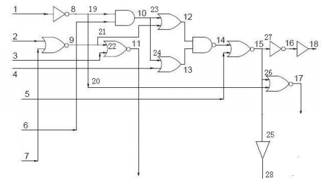

先来计算所有节点的正确值：

1:0, 2:1, 3:1, 4:0, 5:0, 6:0, 7:0, 8:1, 9:0, 10:0, 11:0, 12:0, 13:0, 14:1, 15:0, 16:1, 17:0, 18:1, 28:0

其余点值和上述点有重合

28->25->15->14->12->23->10->6

12->21->9->2

14->13->24->10->6

13->4

18->16->27->15接第一条

可选的故障位置是：28,25,15,14,12,23,10,6,21,9,2,13,24,4,18,16,27

> **9.3** 在如9.2题图所示电路中，当输入1，2，3，4，5，6，7={0010010}的情况下，正确输出为18，17，28={001}，若失效输出为18，28={1，0}，假设电路中只存在一个固定型故障，请给出可疑候选故障。
>
> 

先来计算所有节点的正确值：

1:0, 2:0, 3:1, 4:0, 5:0, 6:1, 7:0, 8:1, 9:1, 10:1, 11:0, 12:1, 13:1, 14:0, 15:1, 16:0, 17:0, 18:0, 28:1

28->15->14->12->10->8->1

10->6

14->13->10->8->1

15->5

18->16->15

单故障，所以27、16、18没有问题，28、25也没有问题

如果15及其之后有故障，那么为了保证17是正确的，20必须为1，所以20没有问题。如果是1或8的问题，那么同时导致了15和20有问题，17也会出错，所以不会是1和8的问题

那么剩下问题就是15、14、12、23、10、19、13、24，5

由于是单故障，如果仅仅是23出故障，最终也是正确的，所以排除这两个。

因此候选问题就是**15：SA0**；**14：SA1**；**12：SA0**；**10：SA0**；19：SA0；**13：SA0**；**24：SA0**；**5：SA1**

> **9.4** 为习题9.3得到的可疑候选故障生成诊断向量，尽可能缩小候选故障的数目。

首先识别等效故障：

5：SA1必然引起15：SA0，14：SA1必然引起15：SA0，12：SA0必然引起15：SA0，13：SA0必然引起15：SA0，因此5：SA1、14：SA1、12：SA0、13：SA0和15：SA0是等效故障

19：SA0必然引起10：SA0，因此二者等效。

首先为了屏蔽10和24的故障，选择令4为1，同时9为1，那么2和7可保持00，因此选取向量0011010，如果是第一个等价类中的故障，那么依然产生失效响应，否则不会响应。这样就区分了1和2、3

再来区分2类和3类：我们选择屏蔽24，放开10，也就是选取0011011，这样24被屏蔽，一旦结果是无故障的，那么24就存在故障，否则10或19存在故障。

# Chapter 8 存储器自测试与自修复

> **7.1** 为了检测存储器固定型故障SAF和跳变时延故障 TDF, March测试的需求分别是什么?

* 为了检测SAF，March测试的需求：
  * 确定故障是否被检测，2个条件：激励（w），观察（r）
  * SAF：<$\forall$/0>或<$\forall$/1>
  * 分别用w1，r1；w0，r0
* 为了检测TDF，March测试的需求：
  * 确定故障是否被检测，2个条件：激励（w），观察（r）
  * TDF：<$\uparrow$/0>或<$\downarrow$/1>
  * 分别用w0，w1，r1；w1，w0，r0

> **7.2** 分析 March C算法能够检测的故障类型。该算法是否可以检测所有的反向耦合故障 CFin和幂等耦合故障 CFid?
> $$
> March C: \Updownarrow w0; \Uparrow (r0,w1); \Uparrow(r1,w0); \Uparrow r0; \Downarrow(r0,w1); \Downarrow(r1,w0); \Updownarrow r0
> $$

* MarchC存在w0r0，w1r1，因此可以检测SAF
* MarchC存在w0w1r1,w1w0r0，因此可以检测TDF
* 由于存在$\Uparrow (rx,\dots,w\bar x)$和$\Downarrow (r\bar x,\dots,wx)$，因此可以检测AF
* 对于CFin，假设两个地址A>B且A跳变会影响B翻转，那么升序写0后读0，会发现B是1，发现CFin；若A<B且A会影响B，那么降序写1后读1，会发现B是0，发现CFin
* 对于CFid，假设两个地址A>B且A跳变会使B为$x$，那么升序写$\bar x$后读$\bar x$，会发现B是$x$；若A<B且A会影响B，那么降序写$\bar x$后读$\bar x$，会发现B是$x$，发现CFid

> **7.3** 写一个 March算法,能够检测所有的状态耦合故障CFst。

MarchC可以检测CFst，如果A>B且A为m会影响B为n且m!=n，那么升序写m后读m就发现B为n，A<B降序同理；若m=n，A>B时，则降序读$\bar m$写$m$时会发现B为$m$，反之同理。

> **7.4** 测试面向字的存储器时,假设字长是16位,需要设计多少数据背景来覆盖字内的耦合故障? 请给出这些数据背景。

需要$log2Ceil(16)+1=5个$

0000_0000_0000_0000, 0101_0101_0101_0101, 0011_0011_0011_0011, 0000_1111_0000_1111, 0000_0000_1111_1111

1111_1111_1111_1111, 1010_1010_1010_1010, 1100_1100_1100_1100, 1111_0000_1111_0000, 1111_1111_0000_0000

> **7.5** 请将 March C算法转化成透明测试算法，用于在线测试。

$$
\Uparrow (ra,wa'); \Uparrow(ra',wa); \Uparrow ra; \Downarrow(ra,wa'); \Downarrow(ra',wa); \Updownarrow ra
$$

# Chapter 9 边界扫描与SoC测试

> **8.1** 请说明一下系统结构测试、系统功能测试和系统诊断测试的异同。它们同芯片结构测试、芯片功能测试和芯片诊断测试有怎样的联系?

系统结构测试、系统功能测试和系统诊断测试都是系统测试的一部分，但着眼点有所不同。它们同芯片结构测试、芯片功能测试和芯片诊断测试有很强的相关性，但属于在不同层次上的测试，一个是在芯片级，一个是在比芯片更高一层的系统级。

* 系统结构测试是用来测试系统间的各个芯片和元器件的物理连接和通信正常，并且验证系统的各个位置上是否正确安装了所要求的元器件或芯片。
* 系统功能测试是用来验证系统的功能完整性以及性能是否达标。功能测试本质上是一种 Pass/Fail 的测试，它的故障检测能力是非常有限的。
* 系统诊断测试的目的是为了定位故障元件，它的一个重要衡量标准是故障诊断精度，即故障定位可以做到的最高精度，也可以解释为可定位的最低层级的故障元件。

> **8.2** 什么是 ICT 技术? 为什么随着时间的推移,它在系统测试中的应用变得越来越困难?

ICT（In-Circuit Test）技术是早期的一种系统测试技术。在该技术中，测试仪通过用探针连接 PCB 板背面的焊点来访问 PCB 板的每一个芯片端口，并通过驱动和观测不同端口上的信号值，可以高效地测试 PCB 板连线的开路、短路等一系列常见故障；与此同时，通过对指定芯片的输入输出端口进行控制和观测，也可以对该芯片实现有效的故障检测。

随着时间的推移，ICT 技术在在系统测试中的应用变得越来越困难，主要有以下两个原因：

1. 成本高。因为探针阵列固定模具需要针对系统板进行定制，成本很高。并且，任何一个系统板的端口布局更新都需要重新定制探针阵列固定模具。
2. 适用局限性。随着系统小型化需求的持续推动和系统封装技术的发展，传统 ICT 技术的 PCB 背板探针已不再能够访问所有的芯片端口，这就需要新的系统测试方法以适应系统封装技术的发展。

> **8.3** 请解释一下，为什么IEEE 1149.1规定IR内部的移位寄存器低2位必须在CaptureIR状态捕获01的值?

这个规定的目的是为了在使用 JTAG 端口进行调试时，能同时检测 JTAG 自身电路的完整性。当工程师在使用 JTAG 设置 IR 时，看到 TDO 的移出值带有多个“01”的标志性特征（对应于板级测试中的多个串联 IR），则表明 JTAG 电路本身基本是正常的，否则，JTAG 电路自身已经出了问题，后面的调试也没有必要进行下去了。

> **8.4** 请描述一下IEEE 1149.1标准如何实现下图器件3的内部逻辑测试。
>
> 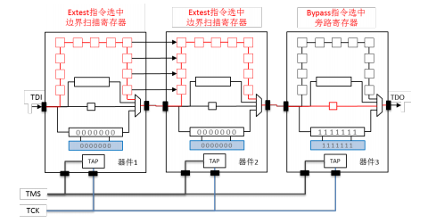

1. 对所有器件串行移入相应的 IEEE 1149.1 指令。器件 1 和器件 2 移入指令Bypass，器件 3 移入指令 Intest。

2. 执行指令更新，每个器件选中相应的数据寄存器，并载入测试激励。器件 1 和器件 2 选中的是旁路寄存器，器件 3 选中的是边界扫描寄存器。

3. 令 Intest 指令下的输出边界扫描单元执行捕获模式，输入边界扫描单元执行更新模式。旁路寄存器则保持状态不变。

4. 移出数据寄存器的值，此为测试响应。

> **8.5** 参看TAP控制器状态图,请标注出对于除 Test-Logic Reset状态外的任一状态,至少需要几个时钟周期才可以返回到Test-Logic Reset状态。它们的返回方式有什么共同点?
>
> 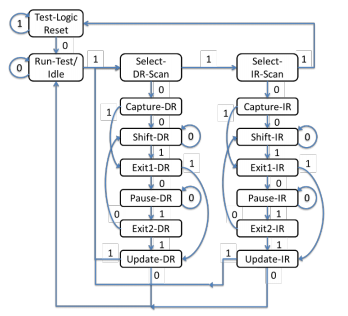

至少需要 1 个时钟周期即可返回到Test-Logic Reset状态，比如 Select-IR-Scan。它们的共同点是若令TMS连续5个时钟周期为1，不论起始状态在哪，状态机都将回到Test-Logic Reset状态。

> **8.6** 请说明IEEE 1500标准中WBR寄存器和WIR寄存器同IEEE 1149.1中的边界扫描寄存器和指令寄存器有哪些异同。

WBR 寄存器为被测核的每个输入输出端口加上了可控制和可观测的扫描单元，它的功能几乎完全借鉴了 IEEE 1149.1 中的边界扫描单元。WIR 寄存器的功能同 IEEE 1149.1 中指令寄存器 IR 类似，所以它的实现方式也类似，即包含一个数据移位部分和一个数据保持部分。但是，每个芯片的 TDI 和 TDO 之间会串联多个 WIR 或是多个WBR，而边界扫描寄存器和指令寄存器只能连接 1 个。

> **8.7** 简要说明IEEE 1500标准和IEEE 1149.1标准有哪些相似点，又有怎样的继承关系。

IEEE 1500 标准是为了实现嵌入式核的模块化测试而设计的，该标准为数字类型的嵌入式核（即逻辑模块和内存模块）定义了一个测试环模块，英文是 Test Wrapper。这个测试环模块借鉴了 IEEE 1149.1 标准的诸多设计思想。IEEE 1500 通过定义测试环模块使嵌入式核以及它的外部逻辑可以在 SoC 芯片中被独立的测试和验证。从某种意义上来说，IEEE 1500 类似于将嵌入式核定义成了“虚拟芯片”，再辅之以 IEEE 1149.1的边界扫描策略来进行测试。

> **8.8** 请简要说明IEEE 1687标准的设计理念，同IEEE 1149.1和IEEE 1500标准相比，其最大的不同点？

IEEE 1687 IJTAG 的设计初衷是为了给不同类型和应用场景的嵌入式仪控提供一个统一和有效的访问机制。同 IEEE 1149.1 和 IEEE 1500 标准相比，IEEE 1687 标准的一个被特别强调的愿景和目标是促进测试向量的重定向，英文是 Test Vector Retargetting或 Pattern Retargetting，即令测试向量从模块级、到芯片级、甚至到系统板级的重定向变得自动化。IEEE 1687 的向量重定向借助于定义在仪控接口处的仪控向量，以及向量传送网路的最简架构信息，从而帮助将仪控接口端的测试向量自动转换成芯片端口的测试向量。

IEEE 1687 标准委员会的专家们因为基于一个共同的认知而走到一起。这个认知即是IEEE 1149.1 和 IEEE 1500 标准有它们一些无法克服的缺陷，导致它们在 DFT 设计整合中出现诸多困难，IEEE 1687 标准即为克服这些困难而诞生。

* 当 SoC 芯片中的嵌入式仪控数目急剧增长时，IEEE 1149.1 标准中集中式的指令寄存器架构使芯片 DFT 整合在物理实现（即布局布线）上遇到了不小的困难，应该说是不利于嵌入式仪控的灵活扩展的。
* IEEE 1149.1 和 IEEE 1500 架构中的数据寄存器定长要求过于严格，即每条指令所对应的数据寄存器的长度是固定的。这限制了 DFT 工程师在设计向量传送网络时所追求的灵活性和多目标的权衡取舍，比如功耗、面积、布局布线和分布式译码等。

> **8.9** 假定所有SIB的初始复位值为0。简要说明：
>
> 1. 同时访问TDR1、TDR2、TDR3、TDR4的测试流程；
> 2. 单独访问TDR1的测试流程（注意：不访问其余的TDR）。
>
> 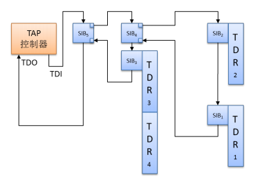

1. 同时访问TDR1、TDR2、TDR3、TDR4的测试流程如下：
   * 把SIB5置为1
   * 把SIB4置为1
   * 把SIB1，SIB2，SIB3都置为1
   * 接下来即可同时访问TDR1、TDR2、TDR3、TDR4

2. 单独访问TDR1的测试流程如下:
   * 把SIB5置为1
   * 把SIB4置为1
   * 把SIB1置为1，SIB2和SIB3仍维持0
   * 接下来即可单独TDR1

> **8.10** 请简要描述一下下面两种测试方案的基本流程：
>
> 1. 假定所有6个核为同质核，如何利用SSN同时并行测试这6个核。
> 2. 假定6个核各不相同，如何只同时测试核1和核6，其余的核不测。
>
> 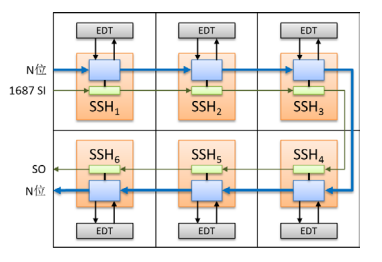

1. 当 6 个核都为同质核时，
   * SSN 首先通过 1 位 IJTAG 控制总线配置所有 SSH 模块，每个 SSH 会从扫描数据流中获取一位移位操作的测试激励和预期测试响应信息，并将与预期测试响应的对比结果作为状态位插入扫描数据流中
   * SSN 通过扫描数据流向所有 6 个核发送相同的测试激励和预期测试响应信息，每个核的对比状态位也通过扫描数据流移出。

2. 假定 6 个核各不相同，只同时测试核 1 和核 6，其余的核不测
   * SSN 首先通过 1 位 IJTAG 控制总线配置所有 SSH 模块，核 1 和核 6 从扫描数据流中获取一位移位操作的测试激励，并将测试响应插入扫描数据流中，核 2 至 5 则被配置成相当于两级有穿透功能的流水线。
   * SSN 通过扫描数据流向核 1 和核 6 传送测试激励，同时核 1 和核 6 的测试响应也通过扫描数据流移出。

# Chapter 10 汽车电子测试

> **10.1** 请简要讲述汽车电子同普通消费电子相比，在芯片测试需求上有什么特殊的地方。

同普通消费电子相比，汽车电子在芯片测试上有以下两点特殊要求

* 测试质量的挑战。即如何在有效控制测试成本的前提下达到接近于0DPPM测试效率。当然，这个测试效率是针对整个芯片，包含数字部分和模拟部分。
* DFT 架构的挑战。DFT 架构的设计要满足汽车电子的现场测试需求；同时这个架构还必须能够无缝衔接地应用到整个电子系统的测试中，并提供不同接口来实现实时的系统测试和诊断。

> **10.2** 自动驾驶技术是从什么方面给车载芯片的测试带来了更大的挑战？

自动驾驶技术主要是从功能安全上给车载芯片的测试带来了更大的挑战，即要求芯片在出现硬件故障的前提下仍能保证车辆和周围行人的安全。

> **10.3** 功能安全验证和芯片设计中的功能验证有什么区别？

功能安全验证则指的是验证一个系统或芯片在出现硬件故障的前提下仍能够保持系统或芯片的安全状态。而功能验证指的是在芯片设计中验证芯片的物理实现同它的设计规范是等价的，包含验证门级网表和电路 RTL 模型之间的等价关系，版图实现和门级网表之间的等价关系等等。

> **10.4** 请简要讲述ISO26262中随机硬件故障的分类， 它们同芯片测试理论中的故障模型有什么联系？

ISO 26262 中随机硬件故障可以分成 6 类，这些故障同测试理论中的固定型故障和瞬时故障有关。

* 安全故障： 它指的是不会对安全逻辑模块造成影响的故障。这类故障要么与安全逻辑之间不存在物理连接；要么是物理连接被某些逻辑门屏蔽掉了。安全故障可以是单个位置的故障，也可以是 n 个位置（n>1）同时发生的故障。ISO 26262的假定是 n>2 的多位置故障都为安全故障。
* 单点故障： 这类故障属于单个位置的故障，故称“单点”。单点故障会造成安全逻辑模块的输出差错。并且，没有安全机制对该安全逻辑模块进行保护。对于功能安全来说，这是需要被特别关注的硬件故障。
* 残余故障：残余故障是一个特殊类型的单点故障，同单点故障一样，残余故障也会造成安全逻辑模块的输出差错，但区别在于该安全逻辑模块有安全机制的保护，但安全机制检测不到这个故障。
* 可检测的多点故障：这类故障来自于多个位置故障的共同作用，但它的故障效应被安全机制检测到，并且，安全逻辑模块的差错输出被修正。因此，这类故障是安全的。
* 可感知的多点故障：这类故障也来源于多个位置故障的共同作用，但故障效应未被安全机制检测到，且没有影响安全逻辑模块的信号输出。虽然没有异常报警，但对驾驶体验有影响，驾驶员可以明显感知到这类故障的存在。可感知的多点故障通常不适用于数字芯片。
* 潜伏的多点故障：潜伏多点故障也来源于多个位置故障的共同作用，同可感知多点故障一样，其故障效应未被安全机制检测到，且没有影响安全逻辑模块的信号输出。但是，和可感知多点故障不一样的是，没有任何迹象表明它甚至存在过。潜伏多点故障本身虽不会导致输出差错，但有很大概率它会影响后继的随机故障检测和纠错。

> **10.5** 什么是车载芯片的系统实时测试？任务模式控制器的作用是什么？

车载芯片的“系统实时测试”指的是在系统的实时运行过程中见缝插针地对特定模块进行结构测试，从而便于车载芯片的实时质量和可靠性监控。任务模式控制器是处于系统和片上测试资源的中间控制模块，其主要作用是实现系统控制的现场测试。