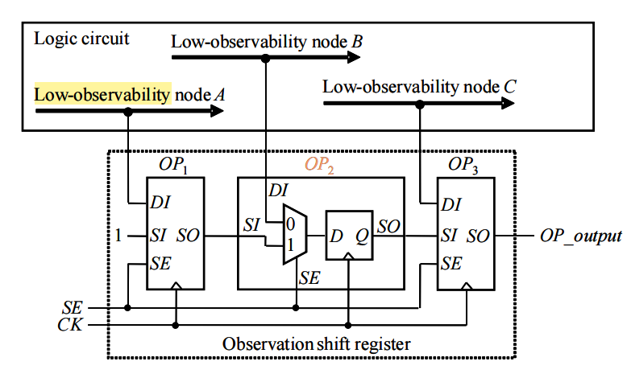

# Chapter 1 引言

## 故障模型

### 故障模型定义

* 一个给定的故障模型有$k$种故障（大部分错误模型中，$k=2$），一个给定的地哪路可能有$n$个故障点。

* 多故障（multiple fault, MF）：元件有多个节点故障

  * 数量：$(k+1)^n-1$

    每个节点都有可能是$k$种故障之一，或者无故障；最后的-1去除掉了所有节点均无故障的情况

* 单故障（single fault, SF）：元件只有单个节点故障

  * 数量：$k \times n$
  * 良好的单故障覆盖通常意味着好的多故障覆盖

* 等效故障：对所有可能的输入模式具有相同行为的一个或多个单个故障，只需要模拟一组等效故障中的一个故障
* 故障删减（fault collapsing）
  * 移除等效故障，只保留需要模拟的故障
  * 减少故障总数

### 固定型故障（stuck-at faults）

> PPT：Stuck-at Faults

* 每一根线都可能是固定为0（SA0）或固定为1（SA1），故$k=2$

* 故障点$n$数量：从节点到另一个节点的线数量（包括分离点）

* 有效测试向量：使输出与正确值不同的向量

  * 一个测试向量可以检测的错误，就是以它为输入时所有与它输出不同的故障，而**不是它可以确定的唯一故障**。

* 故障删减后剩余数量：$2\times (P_o+F_o)+G_l-N_l$

  $P_o$：原始的输出个数，$F_o$：扇出源数量，也就是连到分支点的扇出的线的数量，$G_l$：所有门输入个数总和，$N_l$：非门数量

# Chapter 2 可测试性设计

## 可测试性分析-SCOAP

> PPT：Controllability and Observability

### 组合电路可控制性

* 可控制性描述了使该点值为$k\in{0,1}$的难度，由源逐步向后计算，逐步递增

  * 计算原则：找该输出值对应的输入最容易约束条件
  * 初始设置：$CC_0=1,CC_1=1$

* 基于概率的计算：逐步递减

  * 始终保持$CC_0+CC_1=1$
  * 先计算约束强的可控制性，再用1减去即得另一个

* 常见两输入逻辑电路的可控制性计算

  | 基于拓扑 | $CC_0$                                      | $CC_1$                                      |
  | -------- | ------------------------------------------- | ------------------------------------------- |
  | 与门     | $\min\{CC_0(a), CC_0(b)\}+1$                | $CC_1(a)+CC_1(b)+1$                         |
  | 或门     | $CC_0(a)+CC_0(b)+1$                         | $\min\{CC_1(a), CC_1(b)\}+1$                |
  | 异或门   | $\min\{CC_0(a)+CC_0(b),CC_1(a)+CC_1(b)\}+1$ | $\min\{CC_0(a)+CC_1(b),CC_1(a)+CC_0(b)\}+1$ |
  | 非门     | $CC_1(a)+1$                                 | $CC_1(z)=CC_0(a)+1$                         |

  | 基于概率 | $CC_0$                 | $CC_1$                                      |
  | -------- | ---------------------- | ------------------------------------------- |
  | 与门     | $1-CC_1$               | $CC_1(a)\cdot CC_1(b)$                      |
  | 或门     | $CC_0(a)\cdot CC_0(b)$ | $1-CC_0$                                    |
  | 异或门   | $1-CC_1$               | $CC_0(a)\cdot CC_1(b)+CC_1(a)\cdot CC_0(b)$ |
  | 非门     | $CC_1$                 | $CC_0$                                      |

### 组合电路可观测性

* 可观测性描述了通过输出观测到该点值的难度，由输出逐步向前计算，逐步递增

  * 计算原则：最容易观测的输出的可观测性+使得输出能反映该点值的其他输入组合的可控制性+1
  * 初始设置：$CO=0$

* 基于概率的计算：逐步递减

  * 这时可观测性值越小，难度越大，所以min需要改为max
  
* 常见量输入逻辑电路的可观测性计算

  | 基于拓扑 | $CO$                                       |
  | -------- | ------------------------------------------ |
  | 与门     | $CO(a)=CO(z)\cdot CC_1(b)$                 |
  | 或门     | $CO(a)=CO(z)\cdot CC_0(b)$                 |
| 异或门   | $CO(a)=CO(z)\cdot\max\{CC_0(b), CC_1(b)\}$ |
  | 非门     | $CO(a)=CO(z)$                              |
| 分支导线 | $CO(a)=\max_iCO(z_i)$                      |

## 可测试性设计基础

### Ad Hoc Approach

* 观察低可观察性节点：

  

  SE为1时，电路处于扫描移位模式，从而可以为每个扫描触发器通过扫描链供应所需要的测试数据；SE为0时，电路处于捕获模式，扫描单元用于捕获组合电路的响应。

* 测试低可控制性节点：

  

  测试模式信号TM为1时，所有测试装置被启用；TM为0时，电路的输出DI会被定向到DO上，这时电路处于正常工作状态。

## 扫描架构

### 全扫描设计

* 所有的寄存器都被替换为扫描元件，所有输入可控制，所有输出可观测
* 优点：将时序的自动测试生成（ATPG）转换为组合的ATPG
* 几乎全部的全扫描设计：一部分寄存器没有被替换为扫描元件。
  * 性能考虑：一些存储器在关键路径上
  * 功能考虑：由较小时钟域驱动的存储元素微不足道，不值得为其增加额外的扫描插入工作

### Mux-D全扫描设计

* 通过SI逐位将测试向量移入扫描链，在捕获对应的组合电路输出后，逐周期移位到SO观察输出

* 时序分析：

  

  * 不计算hold的粗略总时间延迟：$(N_{vector}+1)N_{sff}+N_{vector}$，其中+1是capture的一个周期，最后的$N_{vector}$是流水线移出的时间
  * 精准的总时间延迟：$(N_{vector}+3)N_{sff}+(N_{vector}-1)$

## 扫描设计原则

> PPT：扫描设计原则实例

### 三态总线

* 总线争用发生在两个总线驱动器将相反的逻辑值强加到三态总线上时。在正常操作期间，总线争用是设计为不会发生的，并且通常在捕获操作期间被避免。然而，在移位操作期间，无法保证避免这种情况的发生。
* 解决方案：当SE = 1时，将EN1强制设置为1以启用D1总线驱动器，同时将EN2和EN3设置为0以禁用D2和D3总线驱动器。对于没有上拉、下拉或总线保持器的总线，可能会导致故障覆盖率的下降，因此增加了总线保持器。

### 双向IO端口

* 在移位操作期间，双向I/O端口可能会发生冲突。由于扫描单元的输出值在移位操作期间可能会变化，输出三态缓冲器可能会被激活。如果BO和测试器驱动的I/O端口具有相反的逻辑值，则会导致冲突。
* 解决方案：通过在SE = 1时强制将三态缓冲器设置为非活动状态来解决此问题，并在移位操作期间使用测试器驱动 I/O 端口。在捕获操作期间，所施加的测试向量决定双向 I/O 端口是用作输入还是输出，并相应地控制测试器。

### 门控时钟

* 尽管时钟门控是一种降低功耗的良好方法，但它会阻止某些触发器的时钟端口直接由主输入控制。
* 解决方案：时钟门控功能应至少在移位操作期间被禁用。使用一个或门将测试模式信号（TM） 或扫描使能信号（SE）的任意一个使CEN被强制为1。

### 派生时钟

* 派生时钟是由存储元件或时钟发生器内部产生的时钟信号。在整个测试操作过程中，需要绕过这些时钟信号。
* 解决方案：在测试操作期间，当TM = 1时，复用器选择由主输入直接控制的时钟信号CK来驱动DFF1和DFF2。

### 组合反馈环路

* 根据组合反馈环路中反相器的数量是偶数还是奇数，它可能在设计中引入顺序行为或振荡。由于环路中存储的值在测试期间无法控制或确定，这可能会导致测试生成复杂性增加或故障覆盖率下降。
* 可以通过使用测试模式信号TM来解决此问题。该信号通过插入一个扫描点以断开环路，在整个移位和捕获操作期间永久禁用环路。但最好的解决方案是修改RTL代码以解决这个问题

### 异步置位/复位信号

* 扫描单元中未直接由主输入控制的异步设置/复位信号可能会阻止扫描链正确地移位数据。
* 为避免此问题，在移位操作期间将这些异步设置/复位信号强制设置为非活动状态。可以使用一个或门，其一个输入连接到测试模式信号TM。当TM = 1 时，扫描单元SFF2的异步复位信号RL在整个测试操作期间被永久禁用。

# Chapter 3 逻辑与故障仿真

## 仿真模型

### 传播延迟

* Nominal Delay：信号变化后后续信号开始变化的延迟
* Rise/Fall Delay：信号变化后后续信号开始上升/下降变化的延迟
* Minimum/Maximum：信号变化后，在min-max区间内后续信号值不确定。注意不确定的值可能会影响后续，也可能不影响

### 惯性延迟

* Inertial Delay：信号必须保持变化达到这个时间，后续信号才会变化

## 逻辑仿真

### 分级计算

* 用来描述当前元件到输入的最远逻辑层数

### 编译后模拟

* 将所有元件按照层级放入Q队列中
* 若Q不空，则取出队头元件，计算运算值
* 若Q空，则读取下一个测试用例

## 故障仿真

### Parallel Pattern Single Fault Propagation (PPSFP)

* Parallel pattern：将w个1位宽测试打包到一个测试中，并行计算
* Single fault：先测试无故障情况，再对每个故障进行注入，并测试

### Parallel Fault Simulation

* 将给出的w位宽测试纵向拆分，拆成w个测试，并把每一个测试复制k份，k是故障数量+1（无故障情况）
* 每次测试，第1位代表无错误，第2位代表有第一个错误，第3位达标有第二个错误
* 第一次测试，无错误，得到结果；第二次测试，注入第一个错误，以此类推，事实上是有故障和无故障的并行

# Chapter 4 测试生成

## 测试生成方法

### 电路通路

* 逻辑通路：从一个节点到另一个节点
* 物理通路：从输入到输出

### 穷举/伪穷举测试生成

* 在具有多个输出的组合电路中，设$n_{max}$是最大的主输出扇入锥中PI的数量（即可导致PO变化的PI的最大数量），那么最难检测故障的检测概率$d_{min} \ge (0.5)^{n_{max}}$

* 穷举测试：

  * 对具有n个输入的待测组合电路应用2n个测试向量，保证检测到组合电路中的所有可检测故障
  * 如果输入的数量很大，测试时间可能过长，一般只针对小型电路开展

* 伪穷举测试：

  * 将电路划分到多个逻辑锥（cone）中，仅对每个逻辑锥应用穷举测试，可保证检测到每个cone内部（图中A、B部分）的可检测的故障

  * 对于不同输入组对应的重叠部分（图中C区域）的故障，可能无法得到全部的输入值组合，从而导致测试不充分

    

  * 算法：先找到若干不重合的最大依赖逻辑锥，对其进行穷举，再看与之重叠的逻辑锥，补充上没有测试的用例。

### PODEM算法

* 算法步骤
  * 确定故障点和故障值，向前回退到输入点，使该点SA的值能**反相**体现。
    * 回退选取哪个输入可以用可控制性来衡量
  * 将故障点的值设为D，不断向前推进D前沿
    * D前沿：门的概念，输入至少有一个D（故障信号），输出未定
    * 使用蕴含推进：尽可能多的计算课确定的值，如果计算不出，那么就需要回退，找到一个输入点赋值。
  * 若故障至少体现在了一个输出端口，则生成完毕
    * 若所有输入都确定，则为测试向量，否则为测试立方
  * 探索成功需要回溯。
    * 探索过程的管理是通过蕴涵栈（Implication Stack）来实现的蕴涵栈的每一个单元包含信号线的名称，该信号线现在所赋的逻辑值，以及是否已经对该信号线尝试过赋相反的逻辑值的信息。

### 逻辑蕴涵

* 逻辑蕴涵捕捉了在电路中赋予一个门逻辑值时对其他门的影响，帮助ATPG做出更好的决策、避免冲突、减少回溯次数
* 分类：
  * 直接蕴涵：当电路中某个节点被赋予特定值时，根据电路逻辑直接得到的其他节点值的变化
  * 间接蕴涵：通过模拟直接蕴涵所得结果进一步得到的节点值变化
  * 扩展后向蕴涵：通过模拟蕴涵列表里还未确认（unjustified）的蕴涵节点来增加任何单个节点的蕴涵数量

## 不可测故障

### 不可测故障定义

* 无法激活故障：电路设计或逻辑功能限制，使电路无法置于激活特定故障的状态

* 无法将故障效应传播到PO：故障被成功激活，但电路的结构可能阻止故障效应传播

* 无法同时激活和传播：故障激活的条件与将故障效应传播到PO的条件相互矛盾
* 在组合电路中，不可测试故障通常是由于电路中的冗余造成的
* 在时序电路中，不可测试故障还可能由不可达状态或不可能的状态转换引起

### FIRE算法

* 基于冲突分析方法，找到在特定条件下不可检测的故障
* 若需要检测的故障是s，则
  * 先令s=0，计算所有可确定的电路状态，这些就属于不能激活的故障（因为要求s=1时才能激活）
  * 再找到所有被已有电路状态强行控制的信号（例如有一个输入为1的与门的另一个输入信号），这些是不能观测的故障
  * 将二者合并，即为s=0是不可测的故障
  * 再令s=1，重复上述操作，最终将得到的两个集合取交集，即为不可测故障

# Chapter 5 逻辑自测试

## BIST对象电路

### 未确定值屏蔽（X-bounding）

* 能够直接或间接地将其未确定值（X）传播到测试响应分析器的任何未确定值发生源（X源），都必须使用可测试性设计进行未确定值屏蔽

* X屏蔽方法：用于Logic BIST测试模式下（BIST_Mode=1）对X源进行屏蔽

  * 0-控制点：将Z强制设置为0来屏蔽X源的未确定输出
  * 1-控制点：将Z强制设置为1来屏蔽X源的未确定输出
  * 旁路控制点：将Z切换到可变化的外部输入信号来屏蔽X源的未确定输出
  * 利用逻辑门的旁路控制点：将Z切换到电路内部的某个逻辑门的输出信号来屏蔽X源的未确定输出
  * 利用扫描单元的旁路控制点：将Z切换到某个扫描单元的输出信号来屏蔽X源的未确定输出

* 0和1-控制点：控制点的输出Z分别被固定为0和1，对提高故障覆盖率不利

  旁路控制点通过用某个逻辑值可变信号来驱动控制点的输出Z，使之有助于故障覆盖率的提高

## 测试向量生成

### LFSR

* 标准LFSR：

  * n级标准LFSR由n个D触发器和一定数量的异或门（XOR）组成。
  * 由于XOR门位于外部反馈路径上，因此标准LFSR也称为外部XOR型LFSR

  

* 模块化LFSR：

  * 由于每个XOR门都位于两个相邻的D触发器之间，𝑛𝑛级模快化LFSR又被称为内部XOR型LFSR

  * 模块化LFSR的时钟频率高于相应的标准LFSR，因为每级最多引入了一个XOR门的时延

    

* LFSR特征：

  * n级LFSR的内部结构可以用一个n次特征多项式f(x)来描述:
    $$
    f(x)=1+h_1x+\cdots+h_{n-1}x^{n-1}+x^n
    $$
    其中的$h_i$可以是1或0，取决于反馈路径的存在与否

  * 假设$S_i$代表一个$n$级LFSR的初始状态$S_0$在第$i$次移位后的状态，而$S_i(x)$是$S_i$的多项式表示，则$S_i(x)$可表述为如下所示的一个$n-1$级多项式
    $$
    S_i(𝑥) = S_{i_0} +  S_{i_1}x + S_{i_2}x^2 + \cdots  + S_{i_{n-1}}x^{n-1}
    $$
    如果$T$是使得$f(x)$可整除$(1+x^T)$的最小正整数，则$T$称为上述$n$级LFSR的周期

    如果$T=2^n-1$，则该n级LFSR可生成最大长度的序列，因此被称为最大长度LFSR

### 加权测试向量生成

* 这种情况下，一般LFSR会陷入一个较短的循环中，且每一位出现0和1的概率均为50%，那么只需要根据要求，使用与门、非门、或门来构建输出概率即可

## 测试响应分析

### 1计数检测

* 分别记录无故障和有故障的输出流中1的数量，并进行比对
* 错误屏蔽概率：设检测长度为L，正确的有m个1
  * 含义：在所有能检测的错误($2^L-1$)种中恰好有m个1且不是正确的概率
  * $P_{OC}(m)=\frac{C_L^m-1}{2^L-1}$

### 跳变计数检测

* 分别记录无故障和有故障的输出流中跳变次数的数量，并进行比对
* 错误屏蔽概率：设检测长度为L，正确的有m次跳变
  * 在所有能检测的错误($2^L-1$)种中恰好有m个1且不是正确的概率
  * $P_{OC}(m)=\frac{C_{L-1}^m-1}{2^L-1}$

### 串行特征分析

* 将输出序列送入特征寄存器SISR中：

  

* 若SISR的特征多项式为f(x)，长度为L的M=M(x)，则SISR中最后的状态为$M(x)=q(x)f(x)+r(x)$中的余项$r(x)$

* 错误屏蔽概率：$P_{ssa}(n)=(2^{L-n}-1)/(2^L-1)$

* 定义错误多项式$E(x)=M(x)\oplus M'(x)$，若$E(x)$可以被$f(x)$整除，那么错误就不可被检出，否则可以。

# Chapter 6 测试压缩

## 测试压缩模型

### 基本工作原理

* 测试压缩在芯片的扫描链和测试仪之间引入了两个硬件模块

  * 解压缩模块 ：位于扫描链输入和测试仪之间，将来自测试仪的激励信息解压缩并送至扫描链输入端。

  * 压缩模块：位于扫描链输出和测试仪之间，将扫描链输出端的响应信息压缩后传输到测试仪。

* 所有的测试向量信息仍然存储在测试仪上，只不过是信息压缩的形式。

* 测试压缩与另外两种策略的比较
  * 同混合式逻辑内建自测试相比
    * 测试向量数要远小于混合式逻辑内建自测试
    * 在测试时间上要优于混合式逻辑内建自测试和传统的扫描测试在测试仪的操作上是完全一致的，很容易被工业界接受
    * 在芯片设计的测试向量生成流程中，测试压缩和基于扫描测试的 ATPG 也是兼容的

  * 同传统的扫描测试相比
    * 降低了测试仪所需要存储的数据量，延长了以前内存有限的测试仪的使用寿命
    * 在同样的测试仪带宽下，测试压缩可以缩短测试时间

## 测试激励压缩

### 信息编码法

* 字典编码法：
  * 对于测试中的X，将其设为0或1，使得输入的编码种类最少，用尽可能少的码来压缩表示
  * 设原始数据大小为D，压缩后的数据大小C，压缩率：$D/C$ or $(D-C)/D\times 100\%$

### 广播模式法

* 单个广播源改进为多个广播源
  * 每个广播源可以驱动多条扫描链
  * 对扫描链进行兼容性分析，将兼容的扫描链放在同一组中，由相同的测试仪通道驱动
  * 目标故障在广播模式约束下被检测的概率大幅提高，甚至可以不需要串行模式即可以检测所有的目标故障

* 硬件实现非常简单有效，对比较复杂的数字芯片可以轻松实现十几倍的数据压缩效率

### 线性方程法

* 静态种子重置法

  * 设输出为Z，那么根据给出的输出序列，以及LFSR的更新方程，先列出$Z_i$和$Z_{i-k}$之间的更新关系，然后将所有原始的$x_i$带入，使得$Z_i=f(x_0, ... x_n)$，根据这个线性方程，列出方程并求解即可得到LFSR的种子。
  * 编码效率=测试集中的指定位/存储在测试仪上的比特位<=1
  * 优点：只需要存储测试向量的种子，可以有很高的压缩比
  * 缺点
    * 当 LFSR 工作在自动运转模式时，测试仪处在空闲状态，这会浪费测试时间
    * 由于LFSR 的编码特性，其大小必须同测试向量中确定的0/1比特数相当

* 动态种子重置法

  * 动态种子重置在LFSR的自动运行模式中同时插入外部的自由变量
  * 测试仪通过b条输入通道连续不断地将自由变量插入LFSR; LFSR再通过一个线性组合逻辑驱动芯片内部的n条扫描链。通常b远小于n。
  * 优点
    * 测试仪可以不停地输入数据，不会陷入空闲状态
    * 使用更小的LFSR达到与静态种子重置同样的编码效率
  * 缺点：计算复杂度较高，资源消耗较大

## 测试响应压缩

### 基本概念

* 目标：有损压缩响应结果，保证目标故障的检测和诊断，保持其实现方案同现有芯片测试仪平台工作流程的兼容性
* 主要难点：故障抵消和X屏蔽
* 故障抵消：
  * 源于测试响应压缩中不同扫描链同一位置的扫描单元差错位互相抵消，导致目标故障在响应压缩输出端无法被检测到
* X屏蔽：
  * 测试响应中不确定值的存在导致基于异或网络的响应压缩出现了X屏蔽
  * 这些被屏蔽的扫描单元将无法被测试仪观测到

### 基于X耐受性（X-tolerant）的响应压缩

* 将每条扫描链的测试响应都传送到多个压缩输出通道，在不确定值出现的情况下，仍能保证目标故障的差错位至少传送到了其中一个输出通道

* 矩阵的行对应m个扫描链输出，矩阵的列对应n个压缩模块输出，矩阵中的1值代表矩阵行对应的扫描链通过异或逻辑连到了相应的压缩模块输出，0值则代表不存在这个连接关系

  

# Chapter 7 逻辑分析与良率分析

## 诊断质量的评估指标

* 诊断分辨率
  * 诊断工具报告的候选故障总数或候选总数的倒数，理想的诊断分辨率为 1
  * 达到理想的分辨率并不一定意味着命中真实缺陷
* 准确度
  * 若一个候选故障集合中确实有候选故障命中了真实缺陷，则该集合的准确度为1，否则为0
* 命中率
  * 对所有候选故障进行评估，计算所有候选故障包含的真实缺陷点占真实缺陷点总数的比率
  * 总指标，不是单组合的指标

## 组合逻辑故障诊断

### 路径追踪

* 根据电路在各个失效向量下的逻辑值，分析哪些逻辑门或连线与失效响应完全无关
* 路径追踪从失效输出开始分析产生该失效值的逻辑锥，快速筛选可疑故障位置并粗略推测它们在失效向量下的故障值

### 组合逻辑诊断向量生成

* 识别等效故障：
  * 如果一个故障A必定引起另一个故障B，那么A和B就是等效故障
* 只需要能区分不同的等效故障类即可，等效故障是无法区分的
  * 如果不同等效故障类中依然存在“A可能引起B故障”，那就构造一个输入，使得A故障且B不故障时输出仍然正确（屏蔽A）
  * 首先区分出靠后的故障

# Chapter 8 存储器自测试与自修复

## 故障模型

### 固定型故障（SAF）

* 存储单元或信号线的值无法 变化，总为0（stuck-at-0，<$∀$/0>）或总为1（stuck-at-1，<$∀$/1>）
* 基本的测试方法是对所有的存储单元写全0，然后读所有的单元，以检测每个单元的SA1故障；写全1，读所有的单元，以检测每个单元的SA0故障

### 跳变故障（TF）

* 存储单元无法在期望的时间内完成状态的翻转

* 0→1跳变故障，用<$\uparrow$/0>表示

  1→0跳变故障，用<$\downarrow$/1>表示

### 地址译码故障（AF）

* 地址解码器的功能故障
  * 某地址不能访问任何单元
  * 某单元无法被任何地址访问
  * 某地址可以同时访问多个单元
  * 某单元可被多个地址访问到

### 耦合故障（CF）

* 一个存储单元的逻辑值受到另一个单元的内容或操作的影响
  * 反向耦合故障（CFin）：存储单元 j 中的跳变引起单元i的逻辑值发生翻转，两种情况分别表示为：<$\uparrow$;$\updownarrow$>或<$\downarrow$;$\updownarrow$>。
  * 幂等耦合故障（CFid）：存储单元 j 中的跳变，导致单元i的逻辑值为常值 0 或 1，四种情况分别表示为：<$\uparrow$;0>、 <$\uparrow$;1>、<$\downarrow$;0>或<$\uparrow$;1>
  * 状态耦合故障（CFst）：存储单元 j 处于某特定状态时，单元i的逻辑值被强制为0或1，四种情况分别表示为：<0;0>、<0;1>、<1;0>、<1;1>

## 测试算法

### March算法

每个元素由有限个依次施加于所有存储单元的读、写操作组成

$\Uparrow$：代表地址的升序

$\Downarrow$：代表地址的降序

$\Updownarrow$：代表两种顺序都可以

wx：表示写操作，即向地址指定的存储单元写入数据 x；

rx： 表示读操作，即从地址指定的存储单元读出数据并与 x 比较，判断是否一致

### 面向字的存储器测试

* 将位测试扩展为字，扩展后成为数据背景

  * wx->wa,wb
  * rx->ra,rb
* 若字长为$w$，则需要$log2Ceil(n)+1$个数据背景
  * 这些数据背景采用拓展掩码扩展进行构建：
    * 0,01,0011,00001111，通过整体复制到高位补齐，每个数据背景长度等于$w$

  * 相反的数据背景就是数据背景取反

### 对用户透明的存储器在线测试

* 将传统的存储器测试算法替换成透明测试算法

* 放弃原来的存储器初始化操作（写操作）

* 将读操作 r0、r1 和写操作 w0、w1 替换成 ra、ra’、wa、wa’，其中 a 和 a’为存储器中的内容及其非值

* 使用唯一的寻址机制

* 计算参考特征（golden signature，黄金特征），用于响应的比较
  * 测试开始实施之前通过第一个读操作可得到预测参考特征
  * 测试数据应用完成后得到实际的特征，与参考特征比较，判断存储器中是否有故障

# Chapter 9 逻辑扫描与SoC测试

## 针对系统测试和SoC测试的主要协议

### IEEE 1149.1标准

* 边界扫描单元（BSC）：在每个模块的所有输入、输出接口加一个BSR，这个模块存在PI、PO、SI、SO四个接口

  

  * 通常情况下，PI接入PO，正常工作；捕获模式下，PI被捕获到R1；更新模式下，捕获的值会被送到PO；串行以为模式下，SI被送出到SO
  * PI和PO是原有模块的接口

* 工作原理：

  * 对所有器件串行移入相应的 IEEE 1149.1 指令。
  * 执行指令更新，每个器件选中相应的数据寄存器，并载入测试激励。
  * 令对应模块的下的输出边界扫描单元执行捕获模式，输入边界扫描单元执行更新模式。旁路寄存器则保持状态不变。
  * 移出数据寄存器的值，此为测试响应。

### IEEE 1687标准

* IJTAG网络：可配置扫描长度

  

  * 每一个SIB可以配置为0或1。如果为0，那么邻接的TDR就不会被计入扫描长度，否则会被计入。
  * 每一个SIB都需要计入扫描长度

### 基于数据包的扫描测试网络

* 当 6 个核都为同质核时
  * SSN 首先通过1位IJTAG控制总线配置所有SSH模块，每个SSH会从扫描数据流中获取一位移位操作的测试激励和预期测试响应信息，并将与预期测试响应的对比结果作为状态位插入扫描数据流中
  * SSN 通过扫描数据流向所有6个核发送相同的测试激励和预期测试响应信息，每个核的对比状态位也通过扫描数据流移出。

* 假定 6 个核各不相同，只同时测试核1和核6，其余的核不测
  * SSN 首先通过1位IJTAG控制总线配置所有SSH模块，核1和核6从扫描数据流中获取一位移位操作的测试激励，并将测试响应插入扫描数据流中，核2至5则被配置成相当于两级有穿透功能的流水线。
  * SSN 通过扫描数据流向核1和核6传送测试激励，同时核1和核6的测试响应也通过扫描数据流移出。

